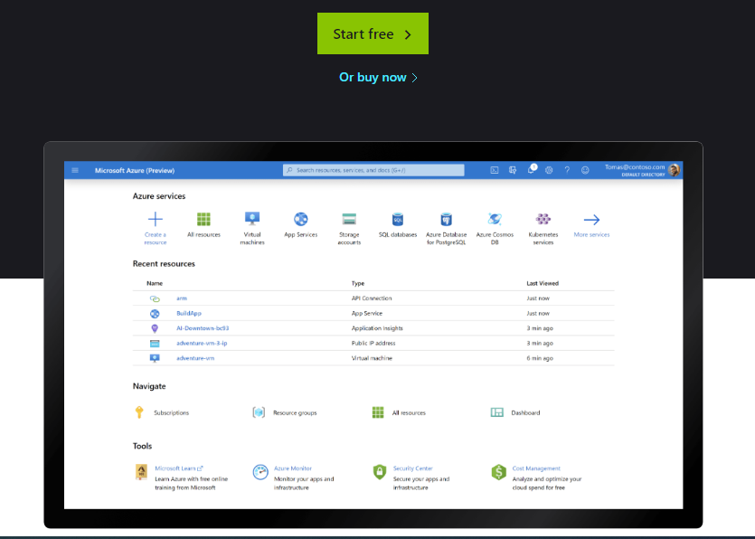

# Lesson 1 Cloud Subscription

You will need to subscribe to a **cloud service provider** to use their resources. You will pay a monthly fee for the cloud services that you consume.

In this lesson, we will subscribe for a free 30 day trial of the **Microsoft Azure Cloud**. You will then the **RCL Web Apps + TLS** portal to manage your Microsoft Azure could services.

## Subscribe to Microsoft Azure Cloud

- Navigate to the [Microsoft Azure Website](https://azure.microsoft.com/en-us/free/)

- Click on the 'Start Free' button to subscribe for your free 30 day trial

- Sign in with your Microsoft account (if you don't have one, you can create a new account in the sign in screen)

- Follow the instructions on the sign-up page to create your azure subscription

## Subscribe to RCL Web Apps + TLS/SSL

Your cloud resources will be provided by Microsoft Azure, you will create and manage these services with the **RCL Web Apps + TLS/SSL** cloud management portal.

- TODO

