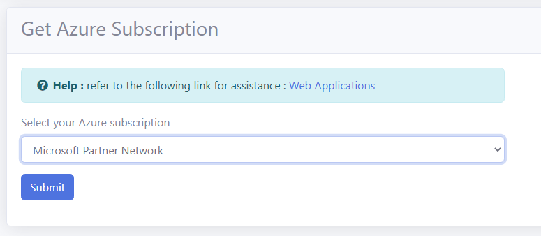
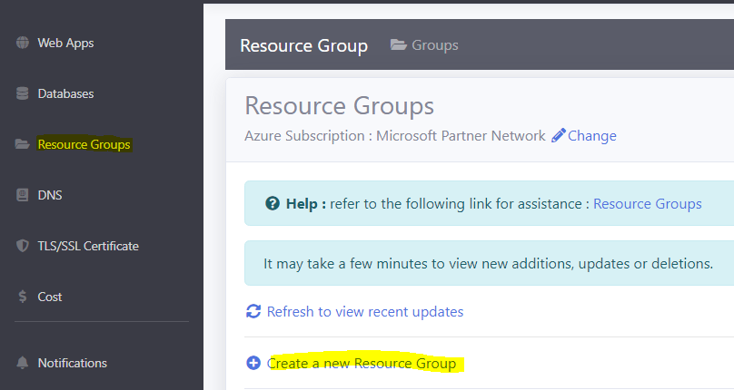
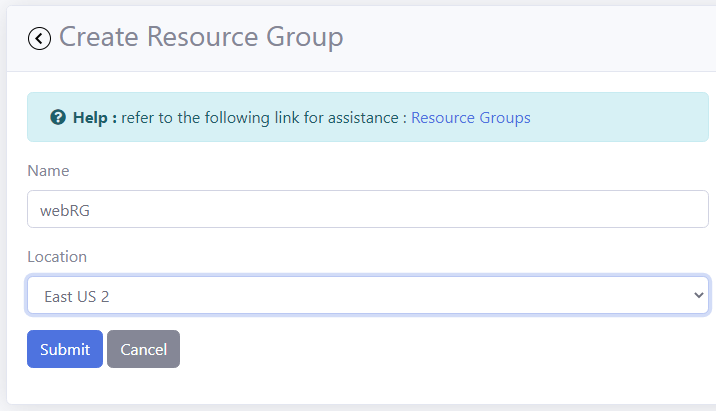
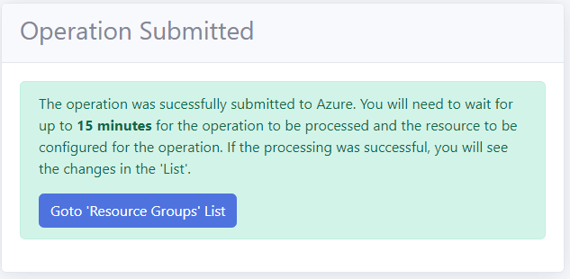
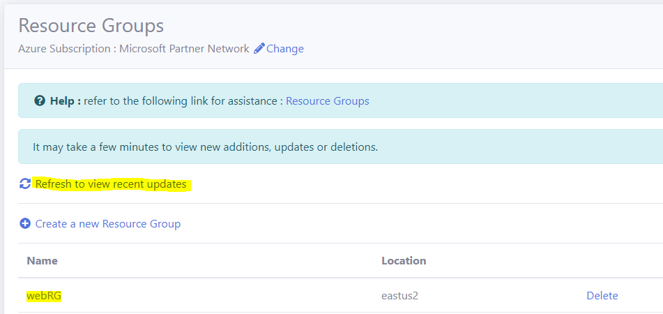

# Lesson 2 Resource Group

A **Resource Group** is a container that holds your cloud resources. It is used as a tool to organize and manage your cloud resources. A resource group will contain your plans, web apps, databases, etc.

## Create a Resource Group

- Open the **RCL Web Apps + TLS/SSL** portal and select your Azure Subscription

- In the side menu, click on 'Resource Groups' and then click on 'Create a new Resource Group' 

- Add a 'Name' for the resource group and select a 'Location'. Click the submit button when you are done

The **Location** is the location of the Microsoft data centre where your resources will be installed 

- The create operation will be submitted to Azure for installation. It may take up to 15 mins for the operation to complete

- In the 'Resource Group List' , you will see the new resource that you created

if you don't see the new Resource Group, wait a few minutes and click on the refresh link. Sometimes a may take a few minutes to create a new resource on Azure.