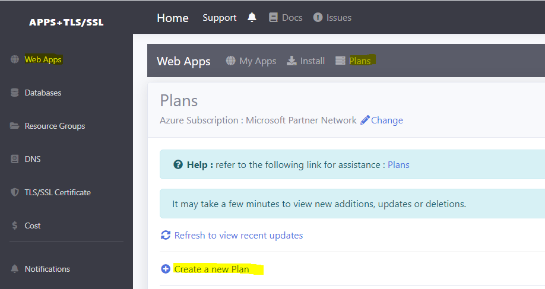
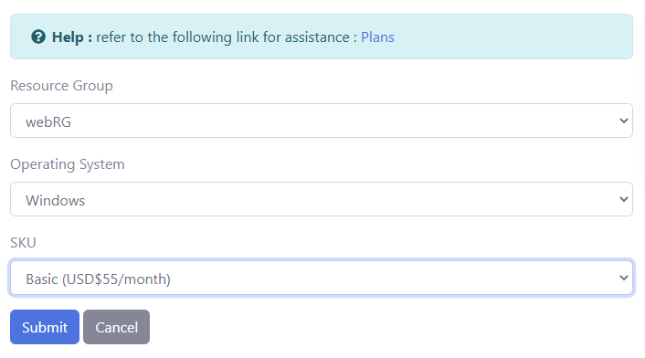
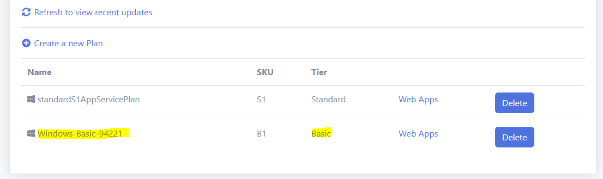

# Lesson 3 Plans

A **Plan** is used to host one or more web applications. 

## SKU/Tiers

The **SKU / Tier** of a **Plan** will determine the compute power and storage capacity of the Plan. The higher the tier, the more compute and storage is allocated to the Plan. Currently, there are three SKU/Tiers available :

- Free SKU/Tier - for testing purposes
- Basic SKU/Tier - for small workloads
- Standard SKU/Tier - for production workloads

The SKU/Tiers above are arranged in increasing size.

You will pay an hourly rate for each SKU/Tier. This rate will apply even though the web applications in the Plan are not running.

## Prerequisites

Before you proceed with this lesson, you should have already created a [Resource Group](https://rcl-cloud-apps.github.io/cloud101/2-resource-groups.html) 

## Create a Plan

- In the **RCL Web Apps + TLS/SSL** portal, click 'Web Apps' in the side menu, then click on 'Plans' in the sub-menu. Click on 'Create a new Plan'

- Create a 'Basic' plan on the 'Windows' operating system

- In the 'Plans List', you will see the new plan

If you don't see the new Plan, wait a few minutes and click on the refresh link. Sometimes, it may take a few minutes to create a new resource on Azure.

# Next Lesson

[Lesson 4 Database](https://rcl-cloud-apps.github.io/cloud101/4-database.html)

