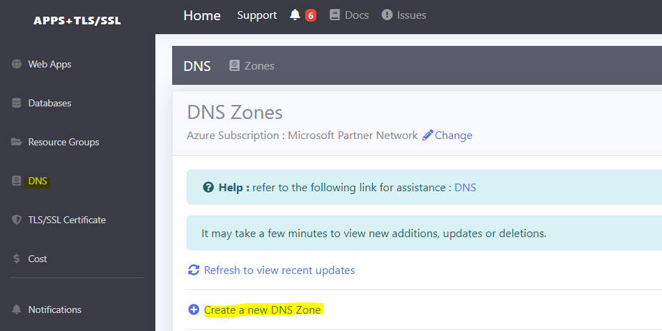
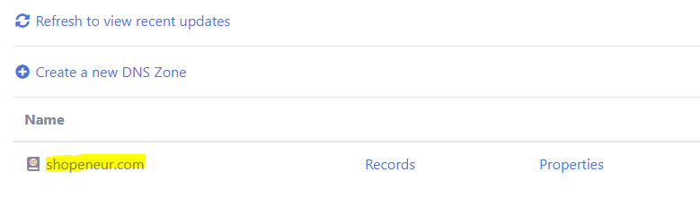
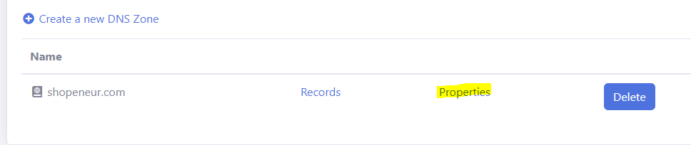
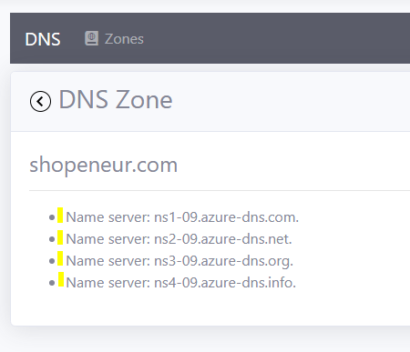

# DNS

A **domain name** is the web address that people type into the URL browser box to access your website. Your domain name can be based on the name of your organization or product.

## Register a domain name

- You can register your domain name with a domain registrar like [Godaddy](https://www.godaddy.com/domains) 

## Create a DNS Zone

A DNS Zone is use to manage your DNS record. DNS records are used to map your website to your domain name.

- In the 'RCL Web Apps + TLS/SSL' portal, click on 'DNS' and then click on 'Create a new DNS Zone'

- Add the domain name you registered previously and select a 'Resource Group'. Click the 'Submit' button when you are done

- The DNS Zone will be added to the 'DNS Zones' list

## DNS Delegation

When you registered you domain with a domain registrar, eg GoDaddy, the registrar will allow you the **delegate** the management of the DNS records by any system of your choice.

In this section, we will delegate your domain from the registrar to the 'RCL Web Apps + TLS' DNS.

- Before you can delegate your domain, you need to know the name servers for your DNS Zone. In the DNS Zones list, click on the 'Properties' link

- Retrieve the name servers from the DNS zone page

- Now that you have the name servers, you need to update the parent domain with the DNS name servers. Each registrar has its own DNS management tools to change the name server records for a domain.

- In your domain registrar, navigate to the DNS portal

- Find the section to change your name servers

- Change the name servers

- Add the name servers and save them

- Your domain name is now fully delegated to your DNS Zone

 