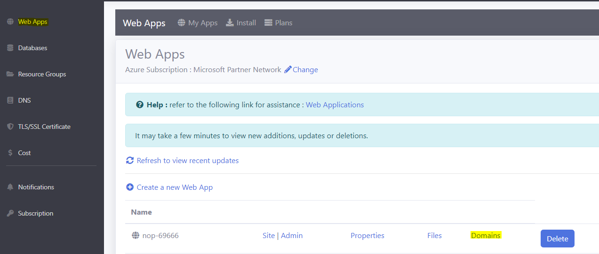
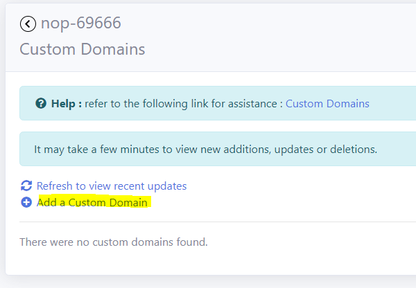
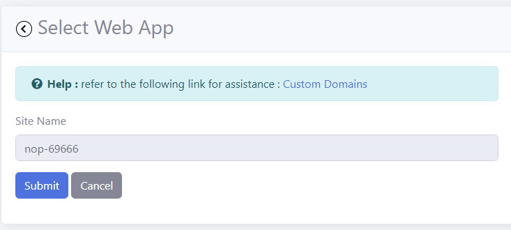
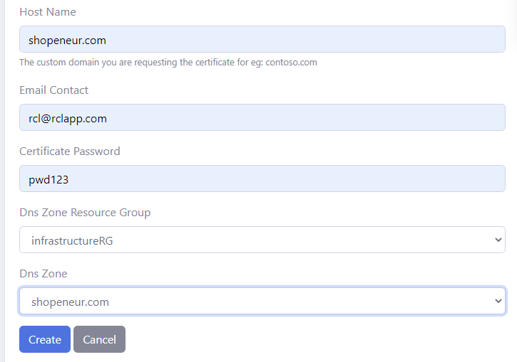
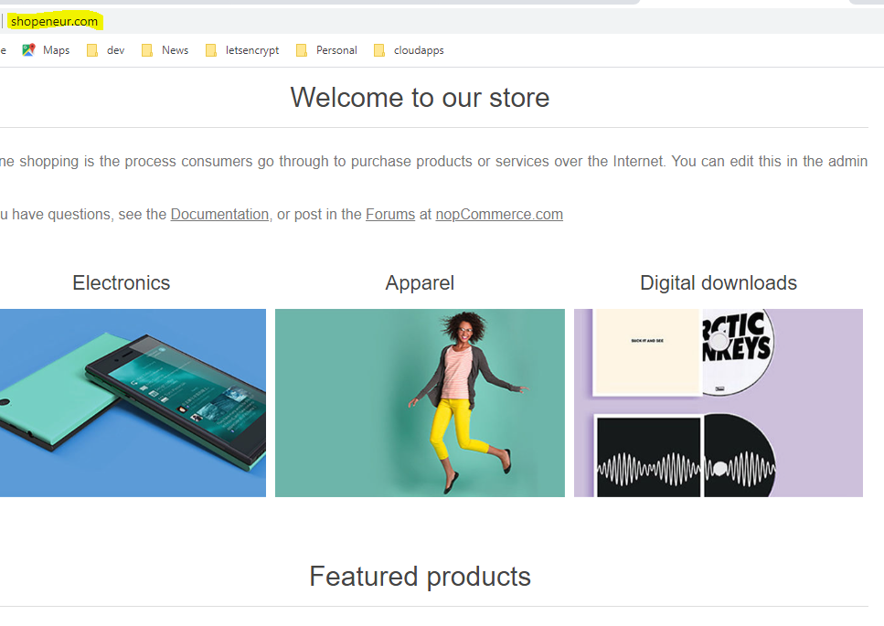

# Lesson 7 Custom Domain

Your website is currently hosted with a shared domain name , eg: 'https://nop-69666.azurewebsites.net'. You will need to host your website with your own custom domain. This will promote the credibility of your organization or product.

## Prerequisites

- Before you proceed with this lesson, you should have registered a **domain name** with a domain registrar, eg: GoDaddy

- You should have created a **DNS Zone** in your Subscription

- You should have **delegated** your DNS from your domain registrar to your DNS Zone

- You should have created a **Web App** in your Subscription

## Create a Custom Domain

- In the 'RCL Web Apps + TLS/SSL' portal, click on 'Web Apps' 

- In your web app, click on the 'Domains' link

- In the Custom Domains page, click on the 'Add a Custom Domain' link

- Select the 'Web App'

- Add the custom domain you registered and your DNS Zone

- You will need to wait for 15 minutes for the custom domain to be created

- When the custom domain is created, it will be displayed in the 'Custom Domains' list. Click on the custom domain link to navigate to your website

- You can navigate to your custom domain using your custom domain, eg : 'https://shopeneur.com', and you will be able to access your website in the browser

# Next Lesson

[Lesson 8 TLS/SSL](https://rcl-cloud-apps.github.io/cloud101/8-tls-ssl.html)