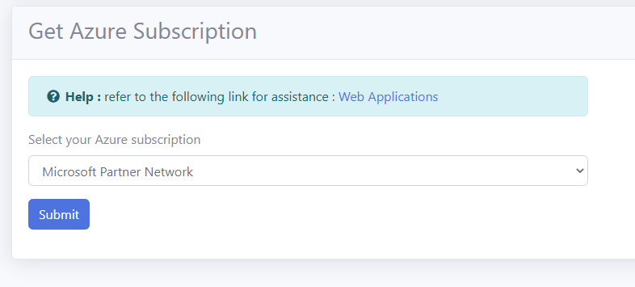

# Lesson: Access Control

**Personal Accounts and Microsoft Accounts are not supported in Access Control. Only Active Directory (also known as 'School or Work Accounts') are supported.**

The Azure Active Directory (AAD) organizational account that you use to login to the **RCL Web Apps + TLS/SSL** app must either be :

- An administrator to the Azure subscription 
- Have a role of 'Owner' or 'Contributor' to the Azure subscription 

## Subscription Administrator
 
You can determine if your AAD account is an administrator on the Azure subscription by logging in to the Azure portal with the same AAD account that you use to login to to the **RCL Web Apps + TLS/SSL** app. 

- Navigate to the **Subscriptions** section 

- Select a subscription 

After you select a subscription, click on the 'My permissions' link for the subscription

- Here your can determine if your AAD account is an administrator or not 

### Owner or Contributor roles

If the AAD account that you use to log in to **RCL Web Apps + TLS/SSL** is not an administrator in the Azure subscription, you need add the AAD account as an 'Owner' or 'Contributor' to the Azure subscription.

- Click on the the 'Access Control (IAM)' link in the Subscription section

- Click on the 'Add' link to add a new role 

- Add a "Contributor' or 'Owner' role assignment to your subscription for the AAD account that you use to login to **RCL Web Apps + TLS/SSL** 

- You will see the new role assignment in the 'Role assignments' tab

**You must do this for each Azure subscription that you want to use in RCL Web Apps + TLS/SSL**

## Test Access Control

Once access control is properly set up for the AAD account that you use to login to **RCL Web Apps + RCL/TLS**, you will see the Azure subscription(s) in the 'Get Azure Subscription' page of the app

# Next Lesson

[Resource Groups](https://rcl-cloud-apps.github.io/cloud101/resource-groups.html)

