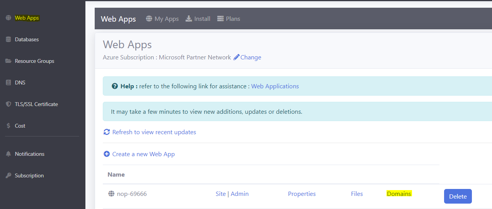
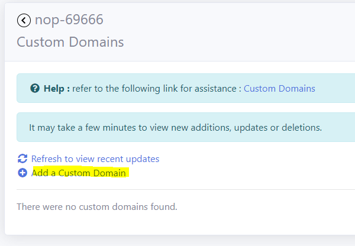
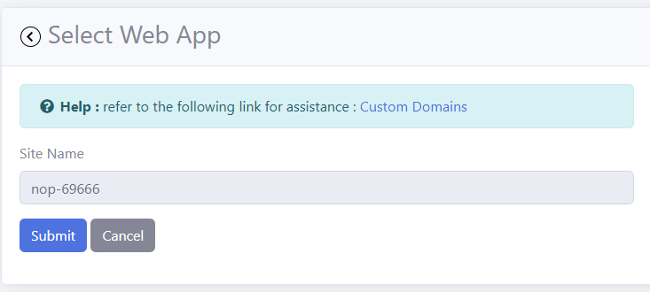
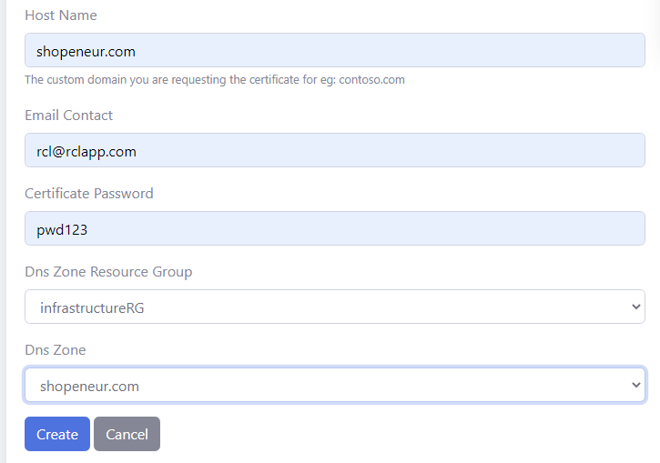
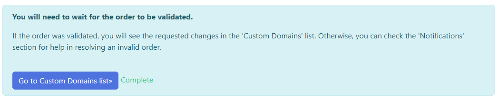
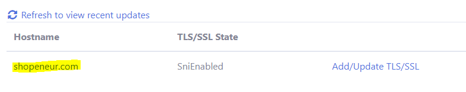
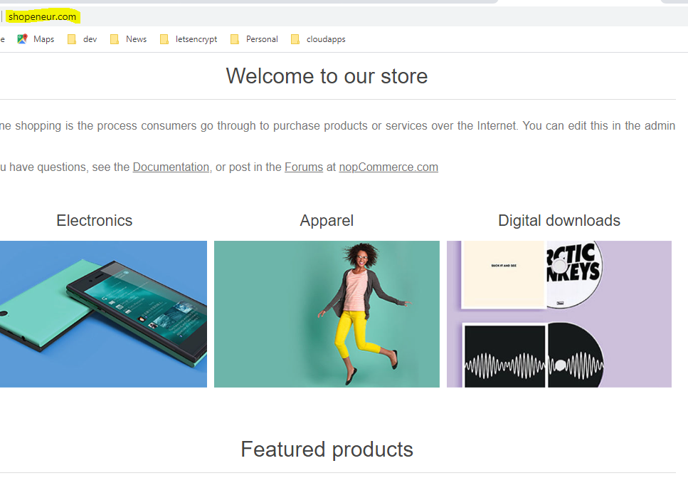

# Lesson: Custom Domain

Your website is currently hosted with a shared domain name , eg: 'https://nop-69666.azurewebsites.net'. You will need to host your website with your own custom domain. This will promote the credibility of your organization or product.

## Prerequisites

- Before you proceed with this lesson, you should have registered a [domain name](https://rcl-cloud-apps.github.io/cloud101/dns.html) with a domain registrar, eg: GoDaddy

- You should have created a [DNS Zone](https://rcl-cloud-apps.github.io/cloud101/dns.html#create-a-dns-zone) in your Subscription

- You should have [delegated](https://rcl-cloud-apps.github.io/cloud101/dns.html#dns-delegation) your DNS from your domain registrar to your DNS Zone

- You should have created a [Web App](https://rcl-cloud-apps.github.io/cloud101/webapp.html) in your Subscription

## Create a Custom Domain

- In the 'RCL Web Apps + TLS/SSL' portal, click on 'Web Apps' 

- In your web app, click on the 'Domains' link

- In the Custom Domains page, click on the 'Add a Custom Domain' link

- Select the 'Web App' and click the 'Submit' button

- Add the custom domain you registered in your DNS Zone

- You will need to wait for 15 minutes for the custom domain to be created

- When the custom domain is created, it will be displayed in the 'Custom Domains' list. Click on the custom domain link to navigate to your website

- You can navigate to your website using your custom domain, eg : 'https://shopeneur.com', in your web browser

# Next Lesson

[TLS/SSL](https://rcl-cloud-apps.github.io/cloud101/tls-ssl.html)