# Lesson Database

Databases store data for your web applications. In this section, we will create a database server and a database.

## Prerequisites

- Before you proceed with this lesson, you should have created a [Resource Group](https://rcl-cloud-apps.github.io/cloud101/2-resource-groups.html) in your Subscription

## Create a Database Server

A Database Server will host one or more databases. To create a database server, follow these instructions :

- In the 'RCL Web Apps + TLS/SSL' portal side menu, click on 'Databases'

- Click on the 'Create a new Database Server' link

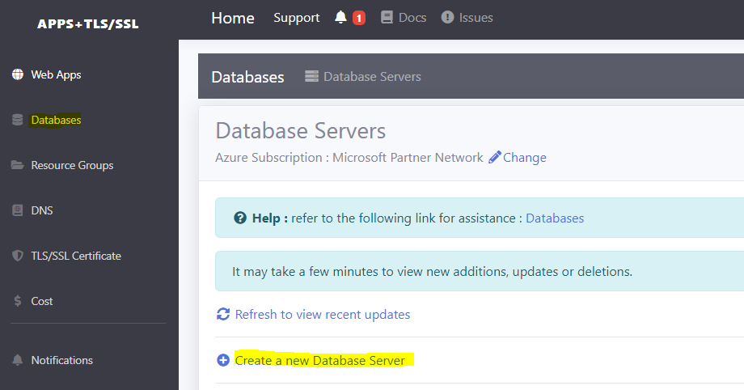

- Create a new 'SQL Server' 

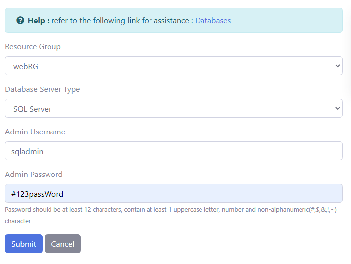

- In the 'Database Servers List', you will see the new SQL Server

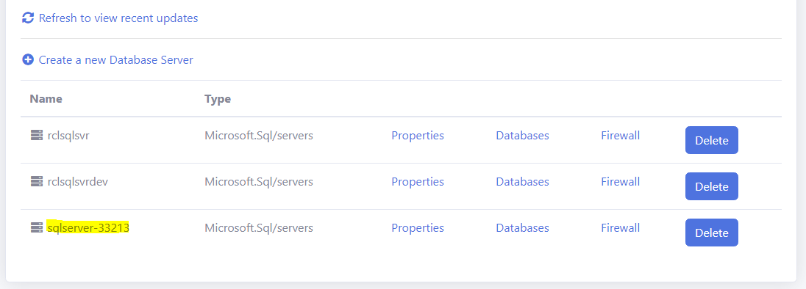

If you don't see the new Database Server, wait a few minutes and click on the refresh link.

SQL Servers are used for ASP.NET web applications, eg. Orchard CMS, DNN, nopCommerce, etc. If you intend to install a ASP.NET application, a SQL Server and Database are requirements for the installation.

## Create a Database

- In the 'Database Servers' list, click on 'Databases' in the Sever that you would like to create the database in

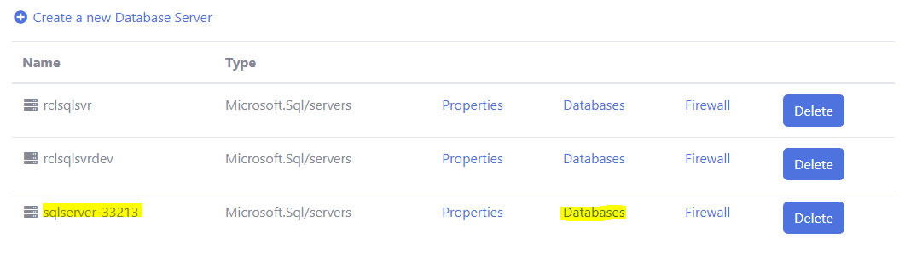

- In the Databases page, click 'Create a new Database'

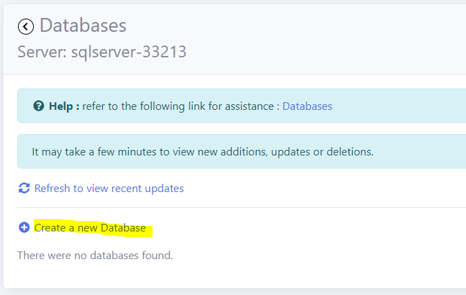

- Add a database name and create a new 'Basic' database. Write down and store the password in a safe location so that you won't forget it

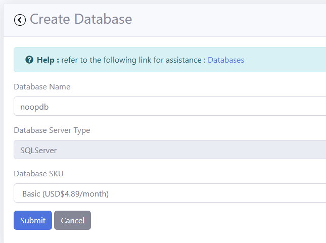

- In the 'Database List', you will see the new SQL Database

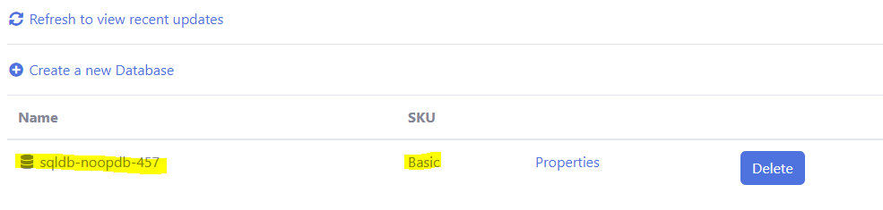

If you don't see the new Database, wait a few minutes and click on the refresh link. 

## Add a Firewall Rule

You must add a firewall rule for web apps to connect to the Database Server.

- In the 'Database Server' list, click on the 'Firewall' link

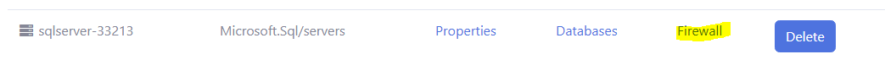

- In the 'Firewall Rules' page, click on 'Create a new Firewall Rule'

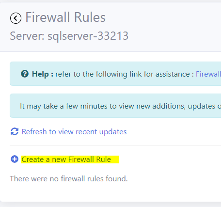

Set the properties of the firewall

- Firewall name - AllowAllWebApps
- Start IP Address - 0.0.0.0
- End IP Address - 0.0.0.0

Click the 'Submit' button when you are done

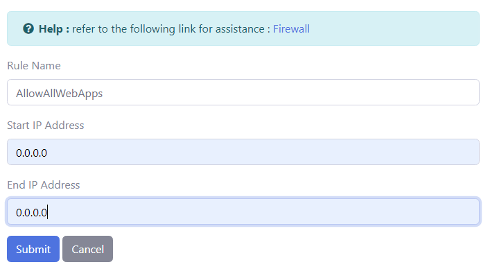

The new firewall rule is shown below

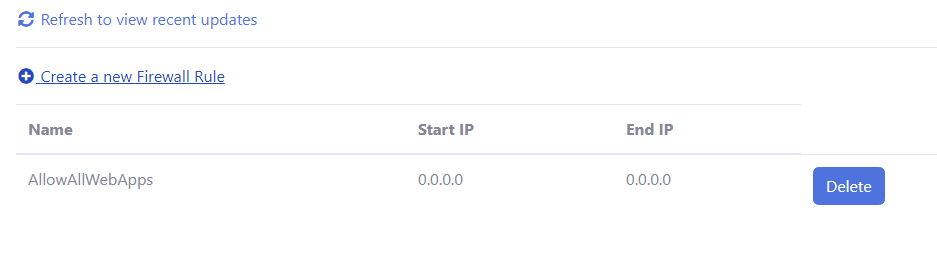

Now, all web apps in your subscription can access the database through the database server firewall.

# Next Lesson

[Lesson 5 Web App](https://rcl-cloud-apps.github.io/cloud101/5-webapp.html)