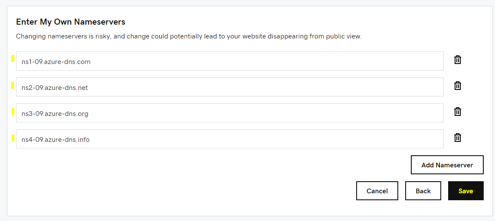
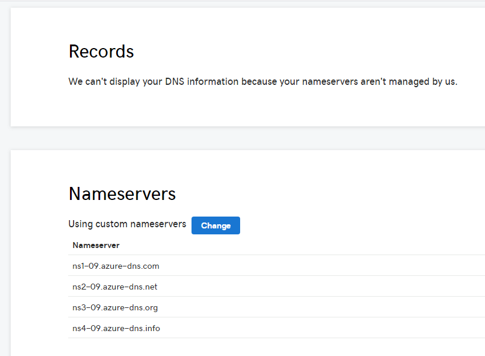

# Lesson: DNS

A **domain name** is the web address that people type into the URL browser box to access your website. Your domain name can be based on the name of your organization or product (eg: microsoft.com, google.com, disney.com). In this lesson, you will learn how to set up a Domain Name System (DNS).

## Register a domain name

- Register your domain name with a domain registrar, eg: [Godaddy](https://www.godaddy.com/domains) 

- The domain registrar will charge you an annual fee for the registration of your domain name

## Create a DNS Zone

A DNS Zone is used to manage your DNS records. DNS records map your website to your domain name.

- In the 'RCL Web Apps + TLS/SSL' portal, click on 'DNS' and then click on 'Create a new DNS Zone'

- Add the domain name you registered previously in the 'DNS Zone Name' text box and select a 'Resource Group'. Click the 'Submit' button when you are done

- The DNS Zone will be added to the 'DNS Zones' list. if you don't see the new DNS Zone, wait a few minutes and click on the refresh link.

## DNS Delegation

When you registered your domain with a domain registrar, eg GoDaddy, the registrar will allow you to **delegate** the management of the DNS records to any system of your choice.

In this section, we will delegate your domain from the registrar to the 'RCL Web Apps + TLS' DNS Zone.

- Before you can delegate your domain, you need to know the name servers for your DNS Zone. In the DNS Zones list, click on the 'Properties' link

- Retrieve the name servers from the DNS Zone page

- Now that you have the name servers, you need to update the parent domain with the DNS name servers

- Each registrar has its own DNS management tools to change the name server records for a domain

- In your domain registrar (eg: GoDaddy), navigate to the DNS portal

- Find the section to change your name servers

- Change the name servers

- Add the name servers from your DNS Zone and save them

- Your domain name from your registrar is now fully delegated to your DNS Zone

# Next Lesson

[Custom Domain](https://rcl-cloud-apps.github.io/cloud101/custom-domain.html)