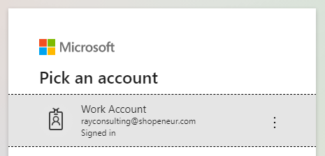

# Lesson Cloud Subscription

You will need to subscribe to a **cloud service provider** to use their resources. You will pay a monthly fee for the cloud services that you consume.

In this lesson, you will subscribe for a free 30 day trial of the **Microsoft Azure Cloud**. You will then use the **RCL Web Apps + TLS** portal to manage your Microsoft Azure could services.

## Subscribe to Microsoft Azure Cloud

- Navigate to the [Microsoft Azure Website](https://azure.microsoft.com/en-us/free/)

- Click on the 'Start Free' button to subscribe for your free 30 day trial

- Sign in with your Microsoft account (if you don't have one, you can create a new account in the sign in screen)

- Follow the instructions on the sign-up page to create your azure subscription

## Subscribe to RCL Web Apps + TLS/SSL

Your cloud resources will be provided by Microsoft Azure (data centre servers, hardware, networking and platforms), you will use these services in the **RCL Web Apps + TLS/SSL** cloud management portal to create web applications for your business.

- In the Azure Portal, search for the 'Marketplace' and open it

- In the 'Marketplace', search for RCL Web Apps +TLS/SSL and open it

- Select the plan and click the 'Set up + subscribe' button

- Add the subscription information, accept the Terms of Service and click the 'Subscribe' button

- After the subscription is complete, click on the 'Configure SasS account on publisher's site'

- **Login in with same account that you use to manage your azure subscription**

- Add your e-mail contact and click the 'Submit' button to activate your account

- Your subscription is now activated. Click the continue button to start using the application

- You will be directed to the application dashboard

# Next Lesson

[Lesson Access Control](https://rcl-cloud-apps.github.io/cloud101/access-control.html)

