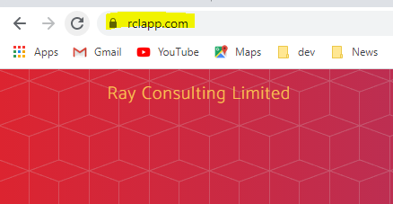
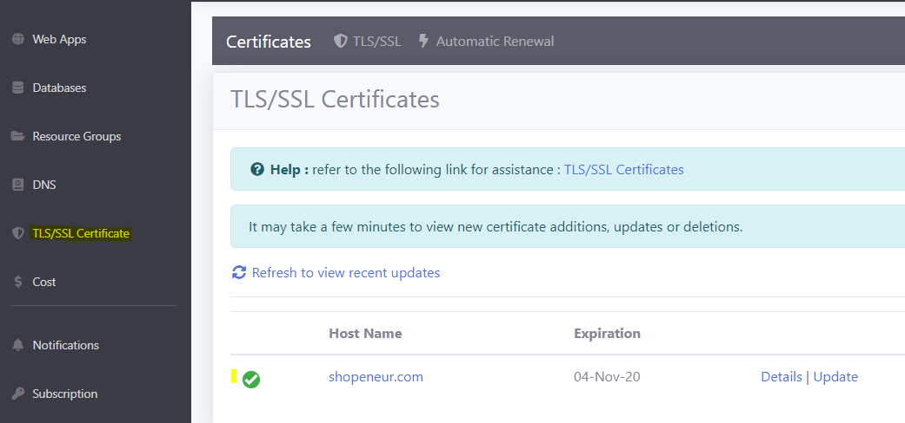
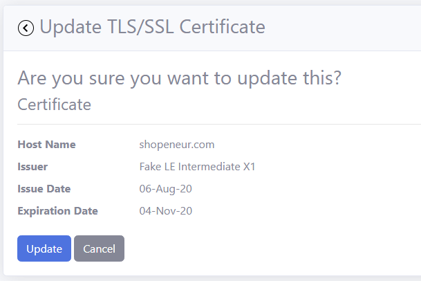

# Lesson: TLS/SSL

TLS/SSL allows your website data to be transported securely. In recent times, TLS/SSL has become a mandatory requirement for a website.

You will access your website using 'https' and a secure icon is shown in the browser. 

## Prerequisites

- Before you proceed with this lesson, you should have registered a [domain name](https://rcl-cloud-apps.github.io/cloud101/6-dns.html) with a domain registrar, eg: GoDaddy

- You should have created a [DNS Zone](https://rcl-cloud-apps.github.io/cloud101/6-dns.html) in your Subscription

- You should have [delegated](https://rcl-cloud-apps.github.io/cloud101/6-dns.html) your DNS from your domain registrar to your DNS Zone

- You should have created a [Web App](https://rcl-cloud-apps.github.io/cloud101/5-webapp.html) in your Subscription

- You should have added a [Custom Domain](https://rcl-cloud-apps.github.io/cloud101/7-custom-domain.html) to your web app

## View TLS/SSL certificates

When you create a custom domain for a web app, a TLS/SSL certificate is automatically created for you and bound to the web app

- In the 'RCL Web Apps + TLS/SSL' portal, click on the 'TLS/SSL Certificate' link

- You will see the list of TLS/SSL certificates in your account and their expiry status

## Update a TLS/SSL certificate

- When a certificate is about to expire, you will see a warning icon

- Click on the 'Update' link in the TLS/SSL certificate list to update a certificate

- Click on the 'Update' button to update the certificate

