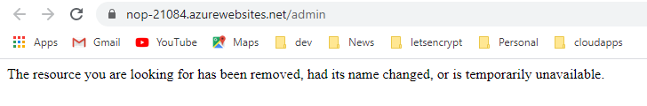

# Lesson Web App

You can install and use many popular open source web applications for your organization. In this lesson, you will learn how to install an e-Commerce web application.

## Prerequisites

- Before you proceed with this lesson, you should have created a [Resource Group](https://rcl-cloud-apps.github.io/cloud101/2-resource-groups.html) in your Subscription

- You should have created a [Plan](https://rcl-cloud-apps.github.io/cloud101/3-plan.html) to host your web app

- You should have created a [Database](https://rcl-cloud-apps.github.io/cloud101/4-database.html) to store the data for your web app

## Create a Web Application

- In the 'RCL Web Apps + TLS/SSL' portal, click on 'Web Apps' in the side menu, then click 'My Apps' in the sub menu. Click on 'Create a new Web App'

- Click on the 'Install' button in the 'nopCommerce' web application

This application is an ASP.NET + SQL Server application. It requires a **SQL Server database** for installation.

- Select the **Resource Group** and **Plan** for the web app

- Select the **Database Server**, enter the username and password. Select the **Database**

- In the 'Web Apps' list you will see the new web app. 

if you don't see the new web app, wait a few minutes and click on the refresh link. Sometimes, it may take a few minutes to create a new resource on Azure.

- Wait for 5 minutes and click on the 'Admin' link.

- When you create a new site and try to access it, you may see that the site is unavailable. Wait for a few minutes and refresh the page

- When the site is being provisioned, you will see the 'Azure Web App' placeholder page. You will need to wait a few minutes until the provisioning is complete and then refresh the page

- After provisioning, your site will be constructed. You will see an 'Under Construction' title in your browser. Wait a few minutes and refresh the page

- After the site is constructed, install nopCommerce. Add admin email and password

- Add SQL Server name, Database name, SQL Server username and password. You will get the SQL Server name on the Database Server **Properties** page.

- Click the 'Install' button when you are done

- You can login to the admin portal of nopCommerce and add product content to build your e-Commerce site

# Next Lesson

[Lesson 6 DNS](https://rcl-cloud-apps.github.io/cloud101/6-dns.html)